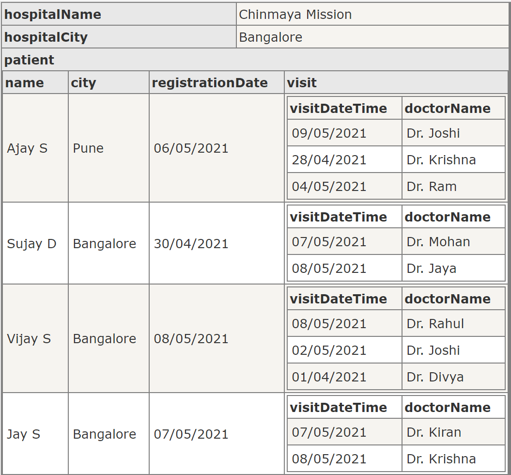

# TestVagrant Hospital Assignment
  This project  test driven approach to solve the  TV Hospital assignment.
  Below tests has been covered:
  1. Test Local Patient percentage vs OutstationPatient Percentage
  2. Test Local Patient percentage vs OutstationPatient Percentage within Last N Registration Days
  3. Test local Patient visit in  Last N Visit Days

    
* project Structure:

   - class Diagram:
   
    
    
   - Test Data( Hospital object Tree)
    
     
    
    
    

* Technology Stack:
  1. Programming language: Java
  2. Build management tool: Maven
  3. Unit Testing Framework: TestNG
  4. Lombok library used for minimize boilerplate code   
    

 * Prerequisite:
    1. JDK 1.8
    2. maven version 3+
    
 *  How to Run:
    * maven command: mvn clean test 

  
  

