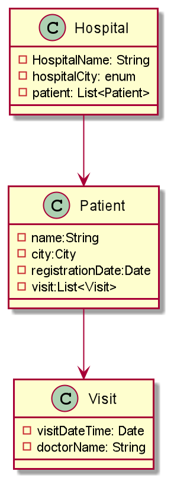

# TestVagrant Hospital Assignment
  This project  test driven approach to solve the  TV Hospital assignment.
  Below tests has been covered:
  1. Test Patient count for city within specified Appointment Date Range
  2. Test Patient count for city within specified Registration Date Range
  3. Test Patient count for city
  4. Test Bangalore Patient percentage vs OutstationPatient Percentage
  5. Test Banglore Patient percentage vs OutstationPatient Percentage within specified Appointment Date Range
  6. Test Banglore Patient percentage vs OutstationPatient Percentage within Last N Regisration Days
    
* project Structure:

   - class Diagram:
   
    
    
   - Test Data( Hospital object Tree)
    
     
    
    
    

* Technology Stack:
  1. Programming language: Java
  2. Build management tool: Maven
  3. Unit Testing Framework: TestNG
  4. Json  library: Google Gson
  5. Lombok library used for minimize boilerplate code   
    

 * Prerequisite:
    1. JDK 1.8
    2. maven version 3+
    
 *  How to Run:
    * maven command: mvn clean test 

  
  

